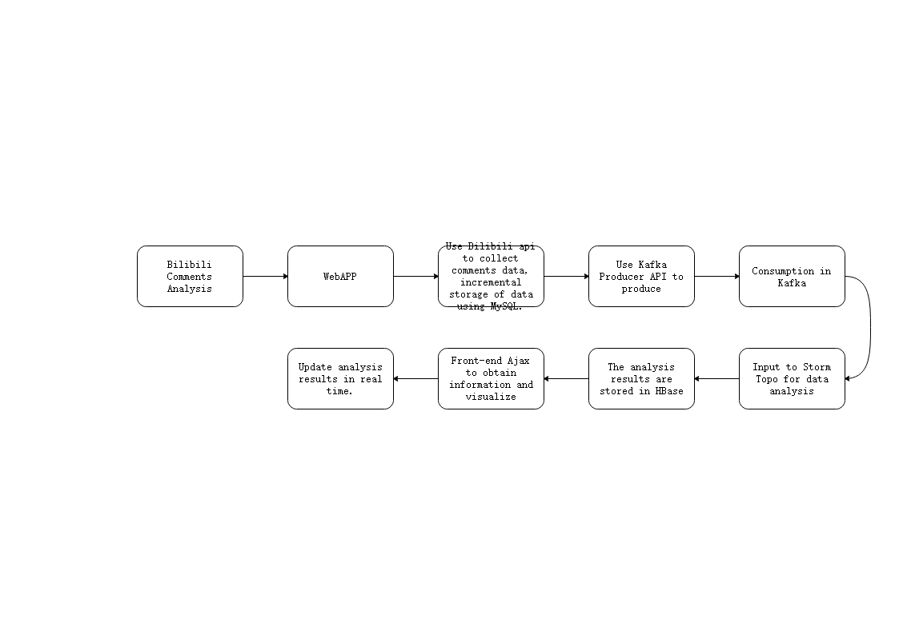

## Bilibili Comments Analysis WebsiteSoftware Requirements Specification

Team:[FattyDelivery](https://github.com/fattydelivery)

<!-- MarkdownTOC levels="2,3" autolink="true" style="unordered" -->

- [1 Background](#1-background)
- [2 Target](#2-target)
- [3 Software Support](#3-software-support)
- [4 Software Requirements Specification](#4-software-requirements-specification)
    - [4.1 Functional Requirement](#41-functional-requirement)
    - [4.2 Performance Requirement](#42-performance-requirement)
    - [4.3 Data Analysis Requirement](#43-data-analysis-requirement)
    - [4.4 Data Visualization Requirement](#44-data-visualization-requirement)
- [5 Flowchart](#5-flowchart)
- [6 Version Update](#6-version-update)
    - [20201218 v0.0.1](#20201218-v001)

<!-- /MarkdownTOC -->

## 1 Background

Based on the advent of the era of big data, the online video website bilibili has entered people's vision through its own unique method. Its advanced comment technology brings video viewers from all over the country and the world together through offline synchronization of information.The comment has become a feature of a special player, and the comment system is the core of the comment player. Different viewers can leave messages on the screen at different or the same time period, leaving the text messages on the server side. After subsequent viewers open the video, they can choose to receive the text messages stored in the video while watching the video. The traditional player comment system is independent of the player, so the content of the comment is mostly centered on the entire video, and the topic is not strong, and there is no feeling of "real-time interaction". The amount of information contained in the bullet screens of multiple videos is relatively large, and these information sources are wide and highly relevant, and are more suitable for relevant analysis and processing of big data.

## 2 Target

By capturing the key words of video comment information, generating data logs, using database storage and using big data processing tools to analyze results such as the frequency and local density of key words, and display the analyzed data in the chart.

## 3 Software Support

OS: Windows(Development), CentOS7(Deployment)

IDE: IntelliJ IDEA

Language: Java(JDK 1.8)

Front-end: Tomcat, Springboot, Ajax

Database: MySQL 8.0, HBase 1.2.2

Data Analysis: Kafka, Storm, Zookeeper

Teamwork: git, shimo

## 4 Software Requirements Specification

### 4.1 Functional Requirement

1. Website application
    (1) BV number search
    The user enters the BV number, clicks the GO button, sends a get request to the server, the server responds, collects and analyzes the comment, and uses Ajax asynchronous processing to obtain relevant information and draw pictures.
    (2) Date range search
    Use the date selection function to select the date of the bulletin that needs to be analyzed, which can help the up owner to find more drainage methods.
    (3) Comment analysis (TBD)
    Analyzes the comment area below the video to find hot words in the comment.
2. Log generation
logs are generated by Logstash, as the producer of Kafka, and stored in MySQL persistent logs are divided into user analysis logs and comment collection logs.
    (1) Comments collection storage
    bilibiliapi:
    - comments: https://api.bilibili.com/x/v1/dm/list.so?oid=3307690
    - video_info: https://api.bilibili.com/x/player/pagelist?bvid=BV1zs411S7sz
   
    table: comments
    structure: pk,BVid,comment_time,comment_kind,comment_size,comment_color,timestamp,comment_pool,sender_id,row_id,text
    (2) User analysis log storage
    table: record
    structure: user_id,timestamp,browser,ip,BVid

3. Data Analysis
For data analysis, see 4.3

4. Data Visualization
For data visualization, see 4.4

### 4.2 Performance Requirement

1. Data accuracy requirements
Time type accuracy: accurate to year, month, day, hour, minute, second, integer variable accuracy: all within the range of Integer integer

2. Adaptively
Generated WebAPP adapts to a variety of terminal use (mobile terminal, PC terminal)

3. Deployability
Utilizing the cross-platform nature of Python, Java, and JavaScript languages, it can be developed under Windows and deployed in Linux environment.

### 4.3 Data Analysis Requirement

Storm integrates Kafka, reads the streaming data subscribed in Kafka, and performs real-time processing and analysis. The following two analyses are mainly realized.

demand:

1. Keyword frequency statistics for comment
   Comment has the characteristics of timeliness, precision, and simplicity. By analyzing the high-frequency keywords that appear in the comment, it is possible to understand the audience's general views, mood, and feelings about the video, and reflect the value of the bilibili videos.
   Implementation method: read all the comment data that appears in the video corresponding to each BV number stored in Kafka, use Storm to perform word frequency statistics, and store the Storm calculation results in hbase for subsequent visual display in word cloud.

2. Analyze the time period for high-frequency bulletins
   Analyze the release time of each comment, and count the time periods during which the comment is frequently released in each video, and you can know which time period the number of people watching this video is larger.
   Implementation method: read the release time of each comment in the video corresponding to each BV number stored in Kafka, use Storm to count the number of comment released in each time period, store the calculation results in hbase, and The results are visualized on the front end in the form of a heat map (the time period when the number of bulletins is released is more dense in the heat map).

### 4.4 Data Visualization Requirement

HBase is used to export and convert the results into JSON-formatted data, and Echarts is used to visualize the final results. In this visualization, thermal diagram and word cloud diagram will be used respectively.

1. Statistical visualization of word frequency of keywords in Bullet screen
In this analysis, common words in Bullet screen are used as keywords, and the usage frequency of common words is used as word frequency to construct the word cloud image.

Choosing a lexicon makes boring text data come alive, visually striking and intuitive, and instantly delivering key information. When we need to conduct in-depth data analysis and research, word cloud can help us better distinguish the importance of different elements; When our raw data is text-based, it can avoid the embarrassing situation that the data cannot be directly represented by the chart, and it doesn't need to be analyzed in the troublesome form of converting the data into digital form.

2. Visualization of high frequency release period of comment
In this analysis, the time stamp is used as the horizontal coordinate, and the color of red is used from light to deep to construct the thermal diagram.

Hotshot displays a graphical representation of a page's favorite areas and geographic areas in a specially highlighted form, showing what is happening in a non-clickable area. The figure can show the click behavior distribution on the web page through the gradient color, the traffic distribution and click distribution on the web page is more intuitive and eye-catching.

## 5 Flowchart

1. Software Execution Flowchart

## 6 Version Update

### 20201218 v0.0.1

Basic function overview.

