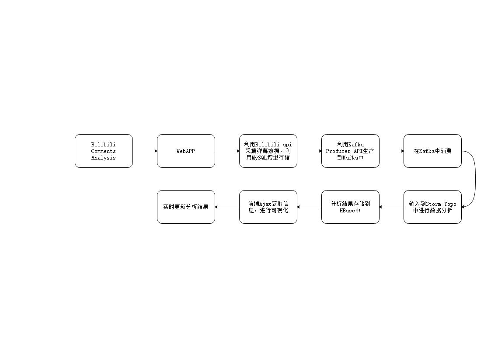

# Bilibili弹幕分析网站需求分析

Team:[FattyDelivery](https://github.com/fattydelivery)

<!-- MarkdownTOC levels="2,3" autolink="true" style="unordered" -->

- [1 背景](#1-%E8%83%8C%E6%99%AF)
- [2 目标](#2-%E7%9B%AE%E6%A0%87)
- [3 软件支持](#3-%E8%BD%AF%E4%BB%B6%E6%94%AF%E6%8C%81)
- [4 软件需求分析](#4-%E8%BD%AF%E4%BB%B6%E9%9C%80%E6%B1%82%E5%88%86%E6%9E%90)
  - [4.1 功能需求](#41-%E5%8A%9F%E8%83%BD%E9%9C%80%E6%B1%82)
  - [4.2 性能需求](#42-%E6%80%A7%E8%83%BD%E9%9C%80%E6%B1%82)
  - [4.3 数据分析需求](#43-%E6%95%B0%E6%8D%AE%E5%88%86%E6%9E%90%E9%9C%80%E6%B1%82)
  - [4.4 数据可视化需求](#44-%E6%95%B0%E6%8D%AE%E5%8F%AF%E8%A7%86%E5%8C%96%E9%9C%80%E6%B1%82)
- [5 流程图](#5-%E6%B5%81%E7%A8%8B%E5%9B%BE)
- [6 更新日志](#6-%E6%9B%B4%E6%96%B0%E6%97%A5%E5%BF%97)
  - [20201218 v0.0.1](#20201218-v001)

<!-- /MarkdownTOC -->

## 1 背景

基于大数据时代的来临，在线视频网站bilibili通过自己特有的方式走入了大家的视野中，其先人一步的弹幕技术将来自全国乃至全世界的视频观看者们通过离线同步的信息方式紧密地联系在一起。弹幕已经成为了一种特殊播放器的特色，弹幕系统则是弹幕播放器的核心。不同观看者可以在不同或者相同时间段在屏幕上进行留言，将文字消息留在服务器端，在后续观看者打开视频之后可选择在观看视频的同时接受该视频存储的文字消息，称之为弹幕，而传统的播放器评论系统是独立于播放器之外的，因此评论的内容大多围绕在整个视频上，话题性不强，也没有"实时互动"的感觉。多个视频的弹幕中所包含的信息量较为庞大，并且这些信息来源广且相关性较强，比较适合用作大数据进行相关的分析及处理。

## 2 目标

通过抓取视频弹幕信息关键词，生成数据日志，利用数据库存储并使用大数据处理工具进行分析得出关键词的频率及局部密度等等结果，并将分析完毕的数据展示到图表中。

## 3 软件支持

OS: Windows(Development), CentOS7(Deployment)

IDE:IntelliJ IDEA

Language: Java(JDK 1.8)

前端: Tomcat, Springboot, Ajax

数据库: MySQL 8.0, HBase 1.2.2

数据分析: Kafka, Storm, Zookeeper

团队协作: git, 石墨文档

## 4 软件需求分析

### 4.1 功能需求

1. 网站应用

    (1) BV号搜索
    用户输入BV号，点击GO按钮，发送get请求到服务器，服务器响应，收集分析弹幕，利用Ajax异步处理即可得到相关信息并绘制图片。

    (2) 日期范围搜索
    利用日期选取的功能，选择需要分析的弹幕发布的日期，可以帮助up主发现更多引流方式的效果。

    (3) 评论分析(TBD)
    分析视频下方的评论区，找到评论中的热词。

2. 日志生成
日志利用Logstash生成，作为Kafka的生产者，同时存储在MySQL中持久化
日志分为用户分析日志和弹幕采集日志
    (1) 弹幕采集存储
    bilibiliapi:
    - comments: https://api.bilibili.com/x/v1/dm/list.so?oid=3307690
    - video_info: https://api.bilibili.com/x/player/pagelist?bvid=BV1zs411S7sz
    
    table: comments
    structure: pk,bvid,comment_time,comment_kind,comment_size,comment_color,timestamp,comment_pool,sender_id,row_id,text
    (2) 用户分析日志存储
    table: record
    structure: user_id,timestamp,browser,ip,bvid

3. 数据分析
详见4.3
4. 数据可视化
详见4.4

### 4.2 性能需求

1. 数据精度需求
时间类型精度：精确到年月日时分秒
整型变量精度：均在Integer整型范围之内
2. 适应性
生成的WebAPP适应多种终端使用（移动端，PC端）
3. 可部署性
利用Python, Java, JavaScript语言的跨平台性质，可以实现在Windows下开发，在Linux环境中部署。

### 4.3 数据分析需求

Storm集成Kafka，读取Kafka中订阅到的流式数据，从而进行实时处理分析，主要实现了以下两个分析需求：

1. 弹幕关键词词频统计
   弹幕具有时效性、精准化、简单化等特点，通过分析弹幕中出现的高频关键词，可以了解观众对于视频的普遍看法、心情、感受等，体现出B站视频的价值。
   实现方式：读取Kafka中存储的每个BV号对应的视频中出现的所有弹幕数据，使用Storm进行词频统计，并将Storm计算结果存储到hbase中用于后续以词云的方式进行可视化展示。

2. 分析弹幕高频发布的时间段
   对每条弹幕发布的时间进行分析，统计每个视频中弹幕高频发布的时间段，可以了解到哪一时间段观看此视频的人数较多。
   实现方式：读取Kafka中存储的每个BV号对应的视频中每条弹幕发布的时间，使用Storm对每个时间段发布的弹幕条数进行统计，将计算结果存储到hbase中，并将结果以热力图的方式（发布弹幕数较多的时间段在热力图中较为密集）进行前端可视化展示。

### 4.4 数据可视化需求

使用HBase将结果导出并转换为json格式的数据，再利用echarts将最终结果进行数据可视化。本次可视化将分别使用热力图和词云图进行展示。

1. 弹幕关键词词频统计可视化
   本次分析使用弹幕中的常用词作为关键字，常用词的使用频次作为词频，构建词云图。
   选择词云图制作，可以使乏味的文本数据散发活力，从视觉上达到更加抢眼直观的效果，并且能够立即传递关键信息。当我们需要进行深入的数据分析研究时，词云可以帮助我们更好的分辨不同元素的重要性；当我们的原始数据基于文本出现时，它可以避免数据无法直接利用图表展现的尴尬情况，不用在麻烦的将数据转化为数字形式再进行分析。

2. 弹幕高频发布时间段可视化
   本次分析使用时间戳作为横坐标，颜色使用红色由浅到深，构建热力图。
   热力图以特殊高亮的形式显示访客热衷的页面区域和访客所在的地理区域的图示，可以显示不可点击区域发生的事情。该图可通过渐变的颜色来呈现网页上的点击行为分布，网站页面的流量分布和点击分布情况更直观和醒目。

## 5 流程图

1. 软件执行流程图

## 6 更新日志

### 20201218 v0.0.1

基本功能概述